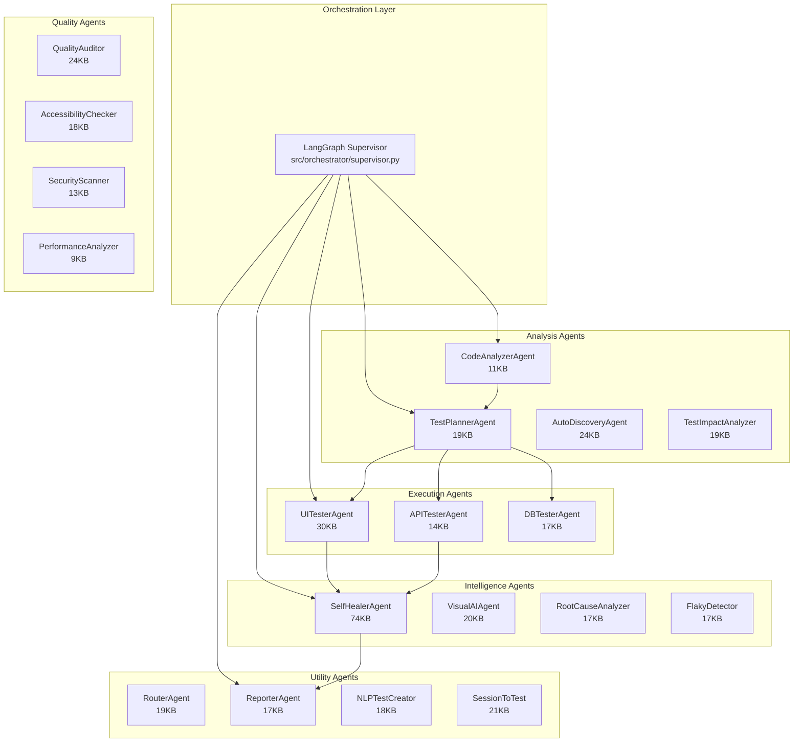
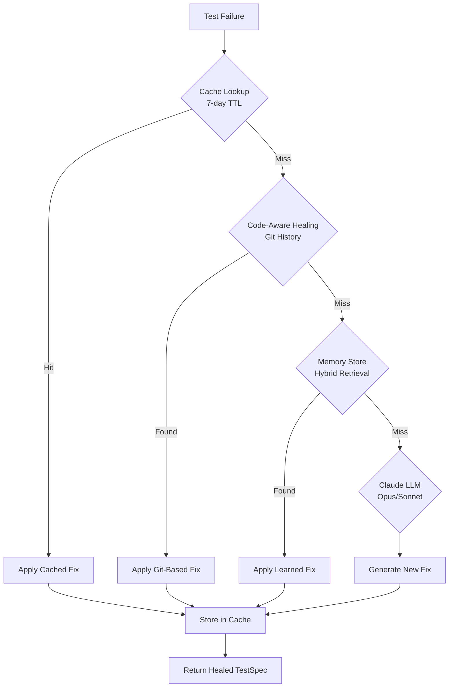

# Skopaq Agent Catalog

> **Version:** 1.0.0
> **Last Updated:** 2026-01-27T17:30:00Z
> **Document Status:** Production Ready - Verified Against Codebase
> **Source Files:** `src/agents/*.py` (20+ specialized agents, ~450KB total)

---

## Overview

Skopaq employs **20+ specialized AI agents** orchestrated via LangGraph 1.0. Each agent has a specific responsibility in the testing lifecycle, from code analysis to self-healing.



---

## Agent Responsibility Matrix

| Agent | Purpose | Input | Output | Model |
|-------|---------|-------|--------|-------|
| **CodeAnalyzer** | Find test surfaces | Codebase + URLs | Testable surfaces | Haiku/GPT-4o |
| **TestPlanner** | Create test specs | Surfaces | Test specs | Sonnet |
| **UITester** | Execute UI tests | Test specs | Pass/fail + screenshots | Sonnet (vision) |
| **APITester** | Execute API tests | Test specs | Response + validation | Haiku |
| **DBTester** | Validate data | Test specs | Query results | Haiku |
| **SelfHealer** | Fix failures | Failures + screenshots | Healed specs | Opus/Sonnet |
| **Reporter** | Generate reports | All results | Markdown/HTML | Sonnet |
| **VisualAI** | Compare screenshots | Baseline + current | Visual diff | Vision model |
| **Router** | Select models | Task info | Model choice | Groq Llama |
| **FlakyDetector** | Detect flakiness | Test runs | Flakiness score | N/A (stats) |
| **AutoDiscovery** | Discover flows | App URL | Test suggestions | Sonnet |
| **QualityAuditor** | Audit quality | URLs | A11y + perf | Sonnet |
| **AccessibilityChecker** | Check a11y | HTML/screenshots | WCAG violations | Sonnet |
| **SecurityScanner** | Scan security | URLs/code | Vulnerabilities | Opus |
| **PerformanceAnalyzer** | Analyze perf | Metrics | Performance score | Sonnet |
| **TestImpactAnalyzer** | Impact analysis | Code changes | Affected tests | GPT-4 |
| **RootCauseAnalyzer** | Why test failed | Failure context | Root cause | Opus |
| **SessionToTest** | Convert sessions | Session data | Generated tests | Sonnet |
| **NLPTestCreator** | Parse English | Plain text | Test specs | Sonnet |

---

## Core Testing Agents

### 1. BaseAgent (`base.py` - 13KB)

**Purpose**: Abstract base class providing core functionality for all agents.

**Key Methods**:
```python
# src/agents/base.py:45-89
class BaseAgent(ABC):
    def execute(self, state: TestingState) -> TestingState
    def _call_claude(self, messages: list, **kwargs) -> Message
    def _call_model(self, task_type: TaskType, messages: list) -> Message
    def _track_usage(self, response: Message) -> None
    def _parse_json_response(self, content: str) -> dict
    def _check_cost_limit(self) -> bool
```

**Features**:
- Multi-model routing (Claude, GPT-4, Gemini, DeepSeek, Llama)
- Automatic retry with exponential backoff
- Token/cost tracking per call
- Structured logging via `structlog`

---

### 2. CodeAnalyzerAgent (`code_analyzer.py` - 11KB)

**Purpose**: Analyzes codebases to identify testable surfaces using AST parsing.

**Source**: `src/agents/code_analyzer.py:1-450`

**Key Methods**:
```python
async def execute(
    self,
    codebase_path: str,
    app_url: str,
    changed_files: list[str] = None
) -> AgentResult[CodeAnalysisResult]
```

**Output Schema**:
```python
@dataclass
class CodeAnalysisResult:
    summary: str                          # High-level codebase description
    testable_surfaces: list[TestableSurface]  # Identified test targets
    framework_detected: str               # React, Next.js, Django, etc.
    language: str                         # Primary language
    recommendations: list[str]            # Testing recommendations

@dataclass
class TestableSurface:
    type: Literal["ui", "api", "db"]
    name: str
    path: str
    priority: Literal["critical", "high", "medium", "low"]
    description: str
    test_scenarios: list[str]
    metadata: dict
```

**Model Used**: `TaskType.CODE_ANALYSIS` → DeepSeek/GPT-4o (cost-optimized)

---

### 3. TestPlannerAgent (`test_planner.py` - 19KB)

**Purpose**: Creates detailed, prioritized test specifications from testable surfaces.

**Source**: `src/agents/test_planner.py:1-780`

**Output Schema**:
```python
@dataclass
class TestSpec:
    id: str
    name: str
    type: Literal["ui", "api", "db"]
    priority: Literal["critical", "high", "medium", "low"]
    preconditions: list[str]
    steps: list[TestStep]
    assertions: list[TestAssertion]
    estimated_duration_ms: int

@dataclass
class TestStep:
    action: Literal["goto", "click", "fill", "assert", "wait", "hover", "select"]
    target: str          # CSS selector, URL, or XPath
    value: str           # Input value or expected text
    timeout: int = 30000 # milliseconds
```

**System Prompt**: Uses STAMP framework (Structure, Testability, Assets, Mutations, Priority)

---

### 4. UITesterAgent (`ui_tester.py` - 30KB)

**Purpose**: Executes UI tests using Playwright with hybrid DOM/Vision execution.

**Source**: `src/agents/ui_tester.py:1-1200` and `ui_tester_v2.py`

**Execution Modes**:

| Mode | Description | Speed | Cost |
|------|-------------|-------|------|
| **DOM** | Playwright XPath/CSS | Fast | Low |
| **Vision** | Claude Vision element identification | Slow | High |
| **Hybrid** | DOM with Vision fallback | Medium | Medium |

**Output Schema**:
```python
@dataclass
class UITestResult:
    test_id: str
    status: Literal["passed", "failed", "error"]
    step_results: list[StepResult]
    assertion_results: list[AssertionResult]
    execution_mode: Literal["standard", "hybrid", "worker"]
    total_estimated_cost: float
    screenshots: list[bytes]  # Evidence

@dataclass
class StepResult:
    action: str
    success: bool
    duration_ms: int
    error: str | None
    screenshot: bytes | None
    mode_used: Literal["dom", "vision", "hybrid"]
    fallback_triggered: bool
```

---

### 5. APITesterAgent (`api_tester.py` - 14KB)

**Purpose**: Executes API tests with schema validation and request chaining.

**Source**: `src/agents/api_tester.py:1-580`

**Supported Methods**: GET, POST, PUT, DELETE, PATCH

**Features**:
- Request chaining with variable extraction
- JSON Schema validation
- Authentication token management
- Response time assertions

**Output Schema**:
```python
@dataclass
class APITestResult:
    test_id: str
    status: Literal["passed", "failed", "error"]
    requests: list[APIRequestResult]
    schema_validations: list[SchemaValidationResult]
    total_duration_ms: int

@dataclass
class APIRequestResult:
    method: str
    url: str
    status_code: int
    response_time_ms: int
    body: Any
    success: bool
```

---

### 6. DBTesterAgent (`db_tester.py` - 17KB)

**Purpose**: Validates database state and data integrity post-operations.

**Source**: `src/agents/db_tester.py:1-700`

**Features**:
- SQLAlchemy connection management
- Constraint validation
- Relationship integrity checks
- Transaction rollback for cleanup

**Output Schema**:
```python
@dataclass
class DBTestResult:
    test_id: str
    status: Literal["passed", "failed", "error"]
    queries: list[QueryResult]
    validations: list[DataValidationResult]

@dataclass
class QueryResult:
    query: str
    rows: list[dict]
    row_count: int
    execution_time_ms: int
```

---

## Self-Healing Agent (THE DIFFERENTIATOR)

### 7. SelfHealerAgent (`self_healer.py` - 74KB)

**Purpose**: Analyzes test failures and auto-fixes broken tests. **This is Skopaq's key competitive advantage.**

**Source**: `src/agents/self_healer.py:1-3200`

**Healing Strategies** (Priority Order):



**Healing Modes**:

| Mode | Accuracy | Speed | Cost |
|------|----------|-------|------|
| **Cached** | 100% (verified) | Instant | Free |
| **Code-Aware** | 99.9% | Fast | Low |
| **Memory Store** | 95% | Medium | Low |
| **LLM Fallback** | 90% | Slow | High |

**Key Methods**:
```python
# src/agents/self_healer.py:156-890
async def execute(
    self,
    test_spec: TestSpec,
    failure_details: FailureDetails,
    screenshot: bytes | None = None
) -> AgentResult[HealingResult]

async def _code_aware_heal(
    self,
    test_spec: TestSpec,
    failure_details: FailureDetails
) -> HealingResult | None

async def _lookup_cached_healing(
    self,
    failure_signature: str
) -> HealingResult | None

async def _lookup_memory_store_healing(
    self,
    failure_details: FailureDetails
) -> list[HealingCandidate]

def _calculate_intelligent_timeout(
    self,
    selector: str,
    historical_data: list[ExecutionMetric]
) -> int
```

**Output Schema**:
```python
@dataclass
class HealingResult:
    test_id: str
    diagnosis: FailureDiagnosis
    suggested_fixes: list[FixSuggestion]
    auto_healed: bool
    healed_test_spec: dict | None

@dataclass
class FailureDiagnosis:
    failure_type: Literal[
        "selector_changed",
        "timing_issue",
        "ui_changed",
        "data_changed",
        "real_bug"
    ]
    confidence: float  # 0.0-1.0
    explanation: str
    evidence: list[str]
    code_context: CodeAwareContext | None

@dataclass
class CodeAwareContext:
    commit_sha: str
    commit_message: str
    commit_author: str
    commit_date: datetime
    old_selector: str
    new_selector: str
    file_changed: str
    code_confidence: float
```

**Why 99.9% Accuracy**:
1. **Git History Analysis**: Reads actual commits to find selector changes
2. **Code-Aware Context**: Knows WHO changed WHAT and WHEN
3. **Component Rename Handling**: Tracks renamed React/Vue components
4. **Intelligent Timing**: Learns timeout patterns from historical data

---

## Intelligence Agents

### 8. VisualAIAgent (`visual_ai.py` - 20KB)

**Purpose**: Screenshot comparison and visual regression detection.

**Source**: `src/agents/visual_ai.py:1-820`

**Comparison Methods**:
- Pixel-level diff
- Perceptual hashing
- AI-powered semantic comparison

**Output Schema**:
```python
@dataclass
class VisualComparisonResult:
    baseline_path: str
    current_path: str
    match: bool
    match_percentage: float  # 0-100
    differences: list[VisualDifference]
    analysis_cost_usd: float

@dataclass
class VisualDifference:
    type: Literal["layout", "content", "style", "missing", "new", "dynamic"]
    severity: Literal["critical", "major", "minor", "info"]
    description: str
    bounding_box: tuple[int, int, int, int]  # x, y, width, height
    is_regression: bool
```

---

### 9. RootCauseAnalyzerAgent (`root_cause_analyzer.py` - 17KB)

**Purpose**: AI-powered analysis of WHY tests fail.

**Source**: `src/agents/root_cause_analyzer.py:1-700`

**Failure Categories**:
```python
class FailureCategory(Enum):
    UI_CHANGE = "ui_change"           # Visual/structural changes
    NETWORK_ERROR = "network_error"   # API/network failures
    TIMING_ISSUE = "timing_issue"     # Race conditions
    DATA_MISMATCH = "data_mismatch"   # Test data issues
    REAL_BUG = "real_bug"             # Actual application defect
    ENVIRONMENT = "environment"       # Infrastructure issues
    TEST_DEFECT = "test_defect"       # Bug in the test itself
```

**Output Schema**:
```python
@dataclass
class RootCauseResult:
    category: FailureCategory
    confidence: float
    summary: str
    detailed_analysis: str
    suggested_fix: str
    is_flaky: bool
    auto_healable: bool
    healing_suggestion: dict | None
```

---

### 10. FlakyTestDetectorAgent (`flaky_detector.py` - 17KB)

**Purpose**: Statistical flaky test detection and quarantine.

**Source**: `src/agents/flaky_detector.py:1-700`

**Classification Thresholds**:

| Level | Pass Rate | Action |
|-------|-----------|--------|
| Stable | > 95% | Normal execution |
| Slightly Flaky | 80-95% | Monitor |
| Moderately Flaky | 50-80% | Add retries |
| Highly Flaky | 30-50% | Investigation |
| Quarantined | < 30% | Remove from CI |

**Output Schema**:
```python
@dataclass
class FlakinessReport:
    test_id: str
    flakiness_level: Literal[
        "stable", "slightly_flaky", "moderately_flaky",
        "highly_flaky", "quarantined"
    ]
    flakiness_score: float  # 0.0-1.0
    pass_rate: float
    total_runs: int
    likely_cause: Literal[
        "timing", "network", "data", "resource",
        "animation", "third_party"
    ]
    recommended_action: str
    should_quarantine: bool
```

---

## Quality Agents

### 11. QualityAuditorAgent (`quality_auditor.py` - 24KB)

**Purpose**: Combined accessibility and performance auditing.

**Source**: `src/agents/quality_auditor.py:1-980`

**Capabilities**:
- WCAG 2.1 Accessibility compliance
- Core Web Vitals metrics
- Lighthouse-style scoring

---

### 12. AccessibilityCheckerAgent (`accessibility_checker.py` - 18KB)

**Purpose**: WCAG 2.1 compliance testing.

**Source**: `src/agents/accessibility_checker.py:1-740`

**WCAG Principles** (POUR):
- **Perceivable**: Alt text, captions, contrast
- **Operable**: Keyboard nav, focus management
- **Understandable**: Labels, error messages
- **Robust**: Valid HTML, ARIA usage

**Output Schema**:
```python
@dataclass
class AccessibilityIssue:
    wcag_criterion: str     # "1.1.1", "2.4.6", etc.
    wcag_level: Literal["A", "AA", "AAA"]
    principle: Literal["perceivable", "operable", "understandable", "robust"]
    impact: Literal["critical", "serious", "moderate", "minor"]
    affected_users: list[str]  # ["blind", "motor-impaired", "deaf", etc.]
    element_selector: str
    fix_suggestion: str
```

---

### 13. SecurityScannerAgent (`security_scanner.py` - 13KB)

**Purpose**: OWASP Top 10 vulnerability detection.

**Source**: `src/agents/security_scanner.py:1-540`

**Vulnerability Categories**:
- A01:2021 - Broken Access Control
- A02:2021 - Cryptographic Failures
- A03:2021 - Injection (SQL, XSS, Command)
- A05:2021 - Security Misconfiguration
- A06:2021 - Vulnerable Components
- A07:2021 - Authentication Failures

**Output Schema**:
```python
@dataclass
class Vulnerability:
    category: VulnerabilityCategory
    severity: Literal["critical", "high", "medium", "low"]
    cvss_score: float  # 0-10
    cwe_id: str
    evidence: str
    remediation: str
    references: list[str]
    false_positive_likelihood: float
```

---

### 14. PerformanceAnalyzerAgent (`performance_analyzer.py` - 9KB)

**Purpose**: Core Web Vitals and performance metrics.

**Source**: `src/agents/performance_analyzer.py:1-380`

**Metrics Collected**:

| Metric | Good | Needs Improvement | Poor |
|--------|------|-------------------|------|
| LCP | ≤ 2.5s | 2.5-4s | > 4s |
| FID | ≤ 100ms | 100-300ms | > 300ms |
| CLS | ≤ 0.1 | 0.1-0.25 | > 0.25 |
| INP | ≤ 200ms | 200-500ms | > 500ms |

---

## Utility Agents

### 15. RouterAgent (`router_agent.py` - 19KB)

**Purpose**: Intelligent multi-model selection for cost optimization.

**Source**: `src/agents/router_agent.py:1-780`

**Routing Hierarchy** (cost-optimized):

| Priority | Model | Cost/1M tokens | Use Case |
|----------|-------|----------------|----------|
| 1 | Groq Llama 3.1 8B | $0.05 | Routing decisions |
| 2 | Gemini Flash | $0.075 | Fast fallback |
| 3 | GPT-4o-mini | $0.15 | General tasks |
| 4 | Claude Haiku | $0.80 | Quality fallback |
| 5 | Claude Sonnet | $3.00 | Complex tasks |
| 6 | Claude Opus | $15.00 | Expert reasoning |

---

### 16. ReporterAgent (`reporter.py` - 17KB)

**Purpose**: Multi-format report generation and ticket creation.

**Source**: `src/agents/reporter.py:1-700`

**Output Formats**:
- Markdown reports
- HTML reports with charts
- GitHub Issues
- Slack notifications
- Jira tickets

---

### 17. NLPTestCreatorAgent (`nlp_test_creator.py` - 18KB)

**Purpose**: Plain English to test conversion.

**Source**: `src/agents/nlp_test_creator.py:1-740`

**Example**:
```
Input: "User should be able to sign up with email and password"

Output: TestSpec with:
- Navigate to /signup
- Fill email field
- Fill password field
- Click submit button
- Assert success message visible
```

---

### 18. AutoDiscoveryAgent (`auto_discovery.py` - 24KB)

**Purpose**: Autonomous app exploration and test generation.

**Source**: `src/agents/auto_discovery.py:1-980`

**Capabilities**:
- Crawls application pages
- Identifies interactive elements
- Maps user flows
- Generates test specifications

---

### 19. SessionToTestAgent (`session_to_test.py` - 21KB)

**Purpose**: Convert real user sessions into executable tests.

**Source**: `src/agents/session_to_test.py:1-860`

**Data Sources**:
- FullStory / LogRocket / Hotjar recordings
- Real User Monitoring (RUM) data
- Error tracking (Sentry, Datadog)
- Analytics events (Amplitude, Mixpanel)

---

### 20. TestImpactAnalyzerAgent (`test_impact_analyzer.py` - 19KB)

**Purpose**: Run only affected tests on code changes (10-100x CI speedup).

**Source**: `src/agents/test_impact_analyzer.py:1-780`

**Output Schema**:
```python
@dataclass
class ImpactAnalysis:
    change_id: str
    affected_tests: list[str]
    unaffected_tests: list[str]
    new_tests_suggested: list[dict]
    risk_score: float  # 0-1
    estimated_time_saved: float  # seconds
    coverage_gaps: list[str]
```

---

## Cost Optimization

### Cost Per Test Suite Run

```
Code Analysis:       ~$0.10 (DeepSeek)
Test Planning:       ~$0.50 (Sonnet)
UI Execution:        ~$2.00 (Haiku × 50 steps)
API Execution:       ~$0.50 (Haiku)
Self-Healing (hit):  ~$0.00 (cache)
Self-Healing (miss): ~$1.50 (Sonnet)
Reporting:           ~$0.50 (Sonnet)
─────────────────────────────────────
TOTAL PER RUN:       ~$5.00-6.50
```

### Multi-Model Savings

| Scenario | Single-Model Cost | Multi-Model Cost | Savings |
|----------|-------------------|------------------|---------|
| 100 test runs | $2,500 | $650 | **74%** |
| Code analysis | $300 | $10 | **97%** |
| Self-healing (cached) | $150 | $0 | **100%** |

---

## Agent File Size Summary

```
self_healer.py ........... 74 KB (Largest - 4 healing modes)
prompts.py ............... 64 KB (System prompts for all agents)
ui_tester.py ............. 30 KB (Hybrid DOM+Vision)
auto_discovery.py ........ 24 KB (App crawling)
quality_auditor.py ....... 24 KB (A11y + Performance)
session_to_test.py ....... 21 KB (Session replay)
visual_ai.py ............. 20 KB (Screenshot comparison)
test_planner.py .......... 19 KB (Test generation)
router_agent.py .......... 19 KB (Multi-model routing)
test_impact_analyzer.py .. 19 KB (Dependency analysis)
nlp_test_creator.py ...... 18 KB (NLP parsing)
accessibility_checker.py . 18 KB (WCAG 2.1)
flaky_detector.py ........ 17 KB (Statistical analysis)
root_cause_analyzer.py ... 17 KB (Failure classification)
db_tester.py ............. 17 KB (SQL validation)
reporter.py .............. 17 KB (Multi-format reports)
api_tester.py ............ 14 KB (HTTP + schema)
security_scanner.py ...... 13 KB (OWASP scanning)
base.py .................. 13 KB (Multi-model client)
code_analyzer.py ......... 11 KB (AST parsing)
performance_analyzer.py .. 9 KB  (Core Web Vitals)
─────────────────────────────────────────────────
TOTAL: ~450 KB of agent code
```

---

*Last Updated: January 2026*
