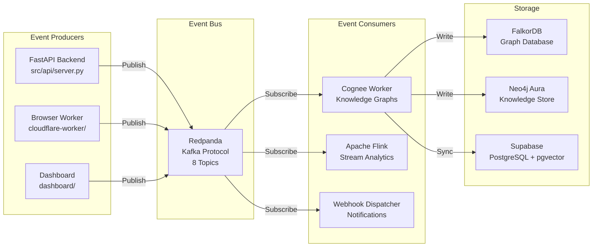
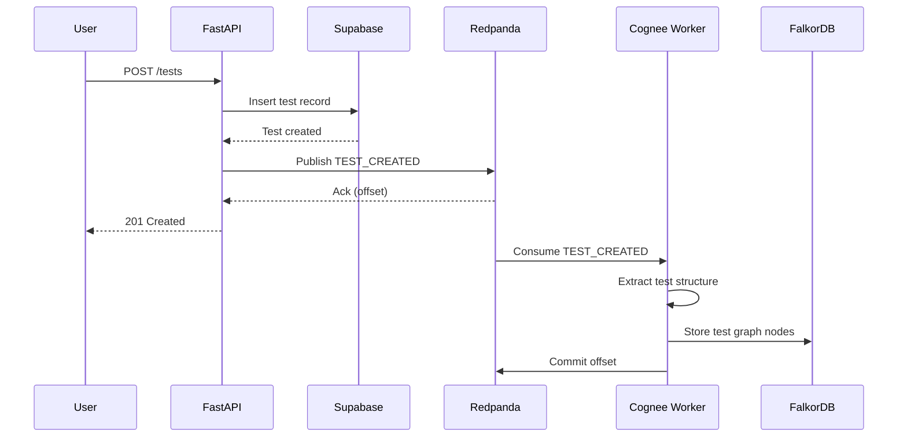
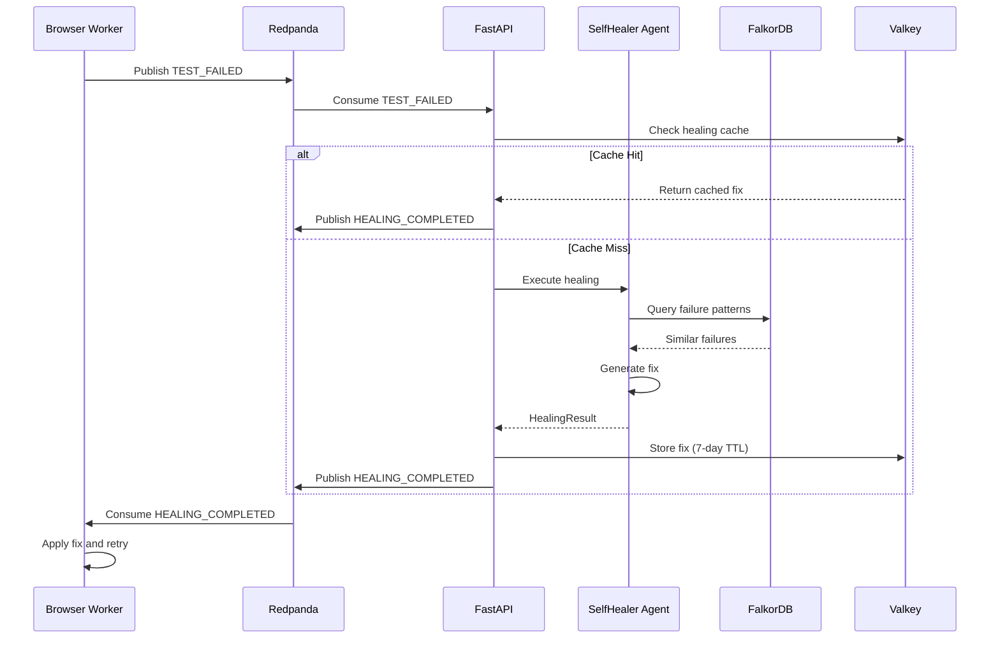
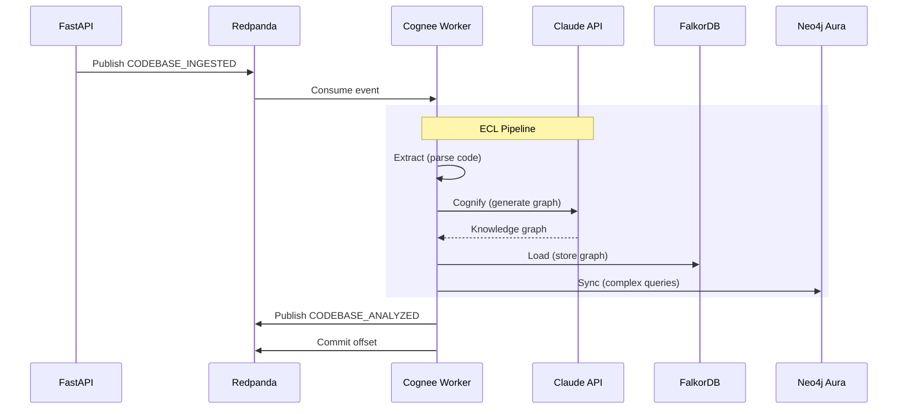

# Event-Driven Architecture

> **Version:** 1.0.0
> **Last Updated:** 2026-01-27T17:30:00Z
> **Document Status:** Production Ready - Verified Against Codebase
> **Source Files:** `src/events/*.py`, `src/services/cognee_consumer.py`

---

## Overview

Skopaq implements an **event-driven architecture** using Redpanda (Kafka-compatible) for asynchronous processing. This enables decoupled, scalable workflows for test execution, self-healing, and knowledge graph building.



---

## Event Types

### Event Enumeration

**File**: `src/events/schemas.py:15-45`

```python
class EventType(str, Enum):
    # Codebase Events
    CODEBASE_INGESTED = "codebase.ingested"
    CODEBASE_ANALYZED = "codebase.analyzed"

    # Test Lifecycle Events
    TEST_CREATED = "test.created"
    TEST_EXECUTED = "test.executed"
    TEST_FAILED = "test.failed"

    # Self-Healing Events
    HEALING_REQUESTED = "healing.requested"
    HEALING_COMPLETED = "healing.completed"

    # Dead Letter Queue
    DLQ = "dlq"
```

### Event Schema

**File**: `src/events/schemas.py:47-120`

```python
@dataclass
class SkopaqEvent:
    """Base event schema for all Skopaq events."""
    event_id: str              # UUID v4
    event_type: EventType      # Event classification
    timestamp: datetime        # ISO 8601 UTC
    source: str                # Producer identifier
    tenant_id: str             # Multi-tenant isolation
    correlation_id: str        # Request tracing
    payload: dict              # Event-specific data
    metadata: dict             # Additional context

    def to_json(self) -> str:
        """Serialize event to JSON for Kafka."""
        return json.dumps({
            "event_id": self.event_id,
            "event_type": self.event_type.value,
            "timestamp": self.timestamp.isoformat(),
            "source": self.source,
            "tenant_id": self.tenant_id,
            "correlation_id": self.correlation_id,
            "payload": self.payload,
            "metadata": self.metadata
        })

    @classmethod
    def from_json(cls, data: str | bytes) -> "SkopaqEvent":
        """Deserialize event from Kafka message."""
        obj = json.loads(data)
        return cls(
            event_id=obj["event_id"],
            event_type=EventType(obj["event_type"]),
            timestamp=datetime.fromisoformat(obj["timestamp"]),
            source=obj["source"],
            tenant_id=obj["tenant_id"],
            correlation_id=obj["correlation_id"],
            payload=obj["payload"],
            metadata=obj.get("metadata", {})
        )
```

---

## Topic Configuration

### Topic Mapping

| Topic Name | Event Types | Partitions | Retention | Purpose |
|------------|-------------|------------|-----------|---------|
| `argus.codebase.ingested` | CODEBASE_INGESTED | 6 | 7 days | Source code upload events |
| `argus.codebase.analyzed` | CODEBASE_ANALYZED | 6 | 7 days | Code analysis results |
| `argus.test.created` | TEST_CREATED | 6 | 7 days | New test specification |
| `argus.test.executed` | TEST_EXECUTED | 6 | 7 days | Test execution results |
| `argus.test.failed` | TEST_FAILED | 6 | 30 days | Test failures (longer retention) |
| `argus.healing.requested` | HEALING_REQUESTED | 6 | 7 days | Self-healing triggers |
| `argus.healing.completed` | HEALING_COMPLETED | 6 | 7 days | Healing results |
| `argus.dlq` | DLQ | 3 | 30 days | Failed message recovery |

### Partitioning Strategy

```python
# src/events/event_gateway.py:89-105
def _get_partition_key(self, event: SkopaqEvent) -> bytes:
    """
    Partition key strategy for event ordering.

    - Codebase events: partition by project_id
    - Test events: partition by test_suite_id
    - Healing events: partition by test_id

    This ensures related events are processed in order.
    """
    if event.event_type in [EventType.CODEBASE_INGESTED, EventType.CODEBASE_ANALYZED]:
        return event.payload.get("project_id", event.tenant_id).encode()
    elif event.event_type in [EventType.TEST_CREATED, EventType.TEST_EXECUTED, EventType.TEST_FAILED]:
        return event.payload.get("test_suite_id", event.tenant_id).encode()
    elif event.event_type in [EventType.HEALING_REQUESTED, EventType.HEALING_COMPLETED]:
        return event.payload.get("test_id", event.tenant_id).encode()
    return event.tenant_id.encode()
```

---

## Event Gateway (Producer)

### Gateway Implementation

**File**: `src/events/event_gateway.py`

```python
class EventGateway:
    """
    Central event publishing gateway with:
    - Connection pooling
    - Automatic retries
    - Circuit breaker pattern
    - Metrics collection
    """

    def __init__(
        self,
        bootstrap_servers: str,
        sasl_username: str,
        sasl_password: str,
        sasl_mechanism: str = "SCRAM-SHA-512",
        security_protocol: str = "SASL_PLAINTEXT",
        compression: str = "gzip"
    ):
        self.producer = AIOKafkaProducer(
            bootstrap_servers=bootstrap_servers,
            sasl_plain_username=sasl_username,
            sasl_plain_password=sasl_password,
            sasl_mechanism=sasl_mechanism,
            security_protocol=security_protocol,
            compression_type=compression,
            acks="all",  # Wait for all replicas
            enable_idempotence=True,
            max_in_flight_requests_per_connection=5
        )

    async def publish(
        self,
        event: SkopaqEvent,
        topic: str | None = None
    ) -> RecordMetadata:
        """
        Publish event to Redpanda.

        Args:
            event: The event to publish
            topic: Override topic (default: derived from event_type)

        Returns:
            Kafka RecordMetadata with offset and partition
        """
        if topic is None:
            topic = f"argus.{event.event_type.value.replace('.', '.')}"

        key = self._get_partition_key(event)
        value = event.to_json().encode("utf-8")

        metadata = await self.producer.send_and_wait(
            topic=topic,
            key=key,
            value=value,
            headers=[
                ("correlation_id", event.correlation_id.encode()),
                ("tenant_id", event.tenant_id.encode()),
                ("source", event.source.encode())
            ]
        )

        logger.info(
            "Event published",
            event_type=event.event_type.value,
            topic=topic,
            partition=metadata.partition,
            offset=metadata.offset
        )

        return metadata
```

### Usage in API

**File**: `src/api/server.py:45-78`

```python
# Initialize event gateway
event_gateway: EventGateway | None = None

@app.on_event("startup")
async def startup_event():
    global event_gateway
    if settings.REDPANDA_BROKERS:
        event_gateway = EventGateway(
            bootstrap_servers=settings.REDPANDA_BROKERS,
            sasl_username=settings.REDPANDA_SASL_USERNAME,
            sasl_password=settings.REDPANDA_SASL_PASSWORD
        )
        await event_gateway.start()

@app.on_event("shutdown")
async def shutdown_event():
    global event_gateway
    if event_gateway:
        await event_gateway.stop()
```

**File**: `src/api/tests.py:120-156`

```python
@router.post("/tests")
async def create_test(
    test_input: TestInput,
    tenant_id: str = Depends(get_tenant_id)
):
    # Create test in database
    test = await test_service.create_test(test_input, tenant_id)

    # Emit event
    if event_gateway:
        event = SkopaqEvent(
            event_id=str(uuid.uuid4()),
            event_type=EventType.TEST_CREATED,
            timestamp=datetime.utcnow(),
            source="api.tests",
            tenant_id=tenant_id,
            correlation_id=get_correlation_id(),
            payload={
                "test_id": str(test.id),
                "test_name": test.name,
                "test_type": test.type,
                "project_id": str(test.project_id),
                "test_spec": test.spec
            }
        )
        await event_gateway.publish(event)

    return test
```

---

## Cognee Consumer (Knowledge Graph Builder)

### Consumer Implementation

**File**: `src/services/cognee_consumer.py`

```python
class CogneeConsumer:
    """
    Kafka consumer that processes events and builds knowledge graphs.

    Implements the ECL (Extract-Cognify-Load) pattern:
    1. Extract: Parse event payload
    2. Cognify: Build knowledge graph with LLM
    3. Load: Store in FalkorDB/Neo4j
    """

    def __init__(
        self,
        bootstrap_servers: str,
        consumer_group: str = "argus-cognee-workers",
        topics: list[str] = None
    ):
        self.consumer = AIOKafkaConsumer(
            *topics or [
                "argus.codebase.ingested",
                "argus.codebase.analyzed",
                "argus.test.created",
                "argus.test.failed"
            ],
            bootstrap_servers=bootstrap_servers,
            group_id=consumer_group,
            auto_offset_reset="earliest",
            enable_auto_commit=False,  # Manual commit after processing
            max_poll_records=10  # Batch size
        )

    async def consume(self):
        """Main consumption loop."""
        async for message in self.consumer:
            try:
                event = SkopaqEvent.from_json(message.value)
                await self._process_event(event)
                await self.consumer.commit()
            except Exception as e:
                logger.error("Event processing failed", error=str(e))
                await self._send_to_dlq(message, e)

    async def _process_event(self, event: SkopaqEvent):
        """Route event to appropriate handler."""
        handlers = {
            EventType.CODEBASE_INGESTED: self._handle_codebase_ingested,
            EventType.CODEBASE_ANALYZED: self._handle_codebase_analyzed,
            EventType.TEST_CREATED: self._handle_test_created,
            EventType.TEST_FAILED: self._handle_test_failed
        }

        handler = handlers.get(event.event_type)
        if handler:
            await handler(event)

    async def _handle_codebase_ingested(self, event: SkopaqEvent):
        """
        Build knowledge graph from ingested codebase.

        1. Extract code structure (AST)
        2. Generate embeddings for functions/classes
        3. Store in FalkorDB as graph
        4. Sync to Neo4j for complex queries
        """
        project_id = event.payload["project_id"]
        codebase_path = event.payload["codebase_path"]

        # Use Cognee ECL pipeline
        from cognee import cognee

        # Add codebase to Cognee
        await cognee.add(
            data=codebase_path,
            dataset_name=f"project_{project_id}"
        )

        # Build knowledge graph
        await cognee.cognify()

        # Store results
        await self._store_knowledge_graph(project_id)

    async def _handle_test_failed(self, event: SkopaqEvent):
        """
        Store failure patterns for self-healing.

        1. Extract failure signature
        2. Find similar past failures
        3. Update failure knowledge graph
        """
        test_id = event.payload["test_id"]
        failure_details = event.payload["failure_details"]

        # Store failure pattern
        await self.falkordb.execute(
            """
            MERGE (f:Failure {signature: $signature})
            SET f.count = COALESCE(f.count, 0) + 1,
                f.last_seen = $timestamp
            MERGE (t:Test {id: $test_id})
            MERGE (t)-[:HAD_FAILURE]->(f)
            """,
            signature=self._compute_failure_signature(failure_details),
            timestamp=event.timestamp.isoformat(),
            test_id=test_id
        )
```

---

## Event Flow Diagrams

### Test Creation Flow



### Self-Healing Flow



### Knowledge Graph Building Flow



---

## Dead Letter Queue (DLQ)

### DLQ Configuration

**Topic**: `argus.dlq`
**Retention**: 30 days
**Partitions**: 3

### DLQ Handler

**File**: `src/events/dlq_handler.py`

```python
async def _send_to_dlq(
    self,
    original_message: ConsumerRecord,
    error: Exception
):
    """
    Send failed message to dead letter queue with error context.
    """
    dlq_event = SkopaqEvent(
        event_id=str(uuid.uuid4()),
        event_type=EventType.DLQ,
        timestamp=datetime.utcnow(),
        source="cognee-consumer",
        tenant_id=self._extract_tenant_id(original_message),
        correlation_id=self._extract_correlation_id(original_message),
        payload={
            "original_topic": original_message.topic,
            "original_partition": original_message.partition,
            "original_offset": original_message.offset,
            "original_key": original_message.key.decode() if original_message.key else None,
            "original_value": original_message.value.decode("utf-8"),
            "error_type": type(error).__name__,
            "error_message": str(error),
            "error_traceback": traceback.format_exc()
        },
        metadata={
            "retry_count": self._get_retry_count(original_message) + 1,
            "max_retries": 3,
            "failed_at": datetime.utcnow().isoformat()
        }
    )

    await self.producer.send_and_wait(
        topic="argus.dlq",
        key=original_message.key,
        value=dlq_event.to_json().encode("utf-8")
    )
```

### DLQ Processing

```python
async def process_dlq(self):
    """
    Process dead letter queue messages.

    Strategy:
    1. Check retry count
    2. If under limit, republish to original topic
    3. If over limit, alert and store for manual review
    """
    async for message in self.dlq_consumer:
        event = SkopaqEvent.from_json(message.value)
        retry_count = event.metadata.get("retry_count", 0)

        if retry_count < event.metadata.get("max_retries", 3):
            # Republish with exponential backoff
            await asyncio.sleep(2 ** retry_count)
            await self.producer.send_and_wait(
                topic=event.payload["original_topic"],
                key=event.payload["original_key"].encode() if event.payload["original_key"] else None,
                value=event.payload["original_value"].encode("utf-8")
            )
        else:
            # Max retries exceeded - alert
            logger.error(
                "DLQ message exceeded max retries",
                event_id=event.event_id,
                original_topic=event.payload["original_topic"],
                error=event.payload["error_message"]
            )
            await self._store_failed_event(event)
            await self._send_alert(event)

        await self.dlq_consumer.commit()
```

---

## Configuration

### Environment Variables

```bash
# Redpanda Connection
REDPANDA_BROKERS=redpanda-0.redpanda.argus-data.svc.cluster.local:9092
REDPANDA_SASL_USERNAME=argus-service
REDPANDA_SASL_PASSWORD=<secret>
REDPANDA_SASL_MECHANISM=SCRAM-SHA-512
REDPANDA_SECURITY_PROTOCOL=SASL_PLAINTEXT

# Consumer Configuration
KAFKA_CONSUMER_GROUP=argus-cognee-workers
KAFKA_AUTO_OFFSET_RESET=earliest
KAFKA_MAX_POLL_RECORDS=10
KAFKA_SESSION_TIMEOUT_MS=30000

# Producer Configuration
KAFKA_ACKS=all
KAFKA_COMPRESSION_TYPE=gzip
KAFKA_ENABLE_IDEMPOTENCE=true
```

### ConfigMap

**File**: `data-layer/kubernetes/cognee-worker.yaml`

```yaml
apiVersion: v1
kind: ConfigMap
metadata:
  name: cognee-worker-config
  namespace: argus-data
data:
  KAFKA_BOOTSTRAP_SERVERS: "redpanda-0.redpanda.argus-data.svc.cluster.local:9092"
  KAFKA_CONSUMER_GROUP: "argus-cognee-workers"
  KAFKA_SECURITY_PROTOCOL: "SASL_PLAINTEXT"
  KAFKA_SASL_MECHANISM: "SCRAM-SHA-512"
  KAFKA_AUTO_OFFSET_RESET: "earliest"
  KAFKA_MAX_POLL_RECORDS: "10"
```

---

## Monitoring

### Consumer Lag Metrics

```bash
# Check consumer lag
kubectl exec -n argus-data redpanda-0 -- \
  rpk group describe argus-cognee-workers \
  -X user=admin -X pass=<password>

# Output:
# GROUP           TOPIC                        PARTITION  CURRENT-OFFSET  LOG-END-OFFSET  LAG
# argus-cognee    argus.codebase.ingested      0          1542            1550            8
# argus-cognee    argus.codebase.ingested      1          1538            1538            0
# argus-cognee    argus.test.created           0          892             892             0
```

### KEDA Scaling Based on Lag

```yaml
# Scales when lag > 10 on argus.codebase.ingested
triggers:
  - type: kafka
    metadata:
      topic: argus.codebase.ingested
      lagThreshold: "10"
      activationLagThreshold: "5"
```

### Alerts

```yaml
# Prometheus AlertManager rule
- alert: KafkaConsumerLagHigh
  expr: kafka_consumer_group_lag > 100
  for: 5m
  labels:
    severity: warning
  annotations:
    summary: "Kafka consumer lag is high"
    description: "Consumer group {{ $labels.group }} has lag {{ $value }}"

- alert: DLQMessagesAccumulating
  expr: kafka_topic_partition_current_offset{topic="argus.dlq"} > 10
  for: 10m
  labels:
    severity: critical
  annotations:
    summary: "DLQ has unprocessed messages"
    description: "Dead letter queue has {{ $value }} messages"
```

---

## Best Practices

### Event Design

1. **Idempotent Processing**: Use `event_id` for deduplication
2. **Correlation Tracking**: Propagate `correlation_id` through the system
3. **Schema Evolution**: Use Avro/Protobuf for backward compatibility
4. **Small Payloads**: Store large data in object storage, reference in events

### Error Handling

1. **Retry with Backoff**: Exponential backoff for transient failures
2. **Circuit Breaker**: Stop processing if downstream is unhealthy
3. **DLQ**: Always have a dead letter queue for failed messages
4. **Alerting**: Monitor DLQ size and consumer lag

### Performance

1. **Batching**: Process messages in batches (10-100)
2. **Compression**: Use gzip for large payloads
3. **Partitioning**: Partition by tenant_id for isolation
4. **Parallelism**: Scale consumers based on partition count

---

*Last Updated: January 2026*
