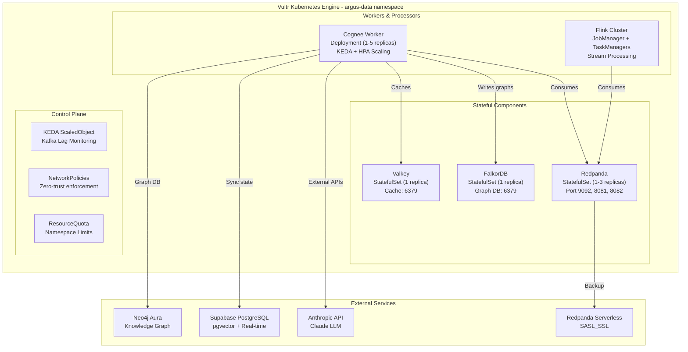
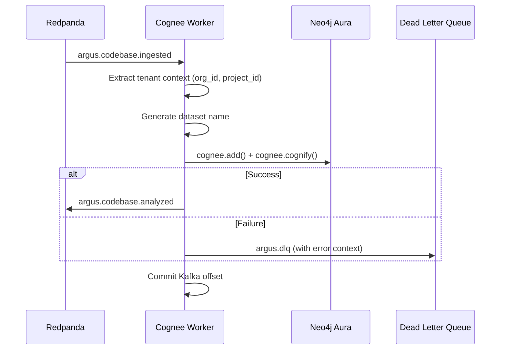

# Kubernetes Infrastructure

> **Version:** 2.0.0
> **Last Updated:** 2026-01-27T19:45:00Z
> **Document Status:** ✅ **FULLY IMPLEMENTED** - All Phases Complete
> **Source Files:** `data-layer/kubernetes/*.yaml` (18 manifests), `data-layer/cognee-worker/` (4 files)

---

## Implementation Status

All phases of the data layer deployment plan have been implemented and validated:

| Phase | Description | Status | Evidence |
|-------|-------------|--------|----------|
| **Phase 1** | Cognee Worker K8s Manifest | ✅ Complete | `cognee-worker.yaml` (321 lines) with HPA, PDB, probes |
| **Phase 2** | Network Policies | ✅ Complete | `network-policies.yaml` (291 lines) zero-trust |
| **Phase 3** | Secrets Configuration | ✅ Complete | `secrets.yaml` template with External Secrets guidance |
| **Phase 4** | Deploy Script | ✅ Complete | `deploy.sh` (264 lines) with `--generate-secrets` |
| **Phase 5** | Backend Integration | ✅ Complete | `src/api/server.py:2357-2399`, `src/api/tests.py:437-440` |
| **Phase 6** | Environment Variables | ✅ Complete | ConfigMap in `cognee-worker.yaml:6-69` |

### Additional Implementation (Beyond Original Plan)

| Component | Status | Files |
|-----------|--------|-------|
| **KEDA Autoscaling** | ✅ Complete | `keda-cognee-scaler.yaml` - Kafka lag-based scaling |
| **Flink Platform** | ✅ Complete | `flink-operator.yaml`, `flink-cluster.yaml`, `flink-platform/` |
| **Cognee Worker Source** | ✅ Complete | `data-layer/cognee-worker/src/worker.py` (710 lines) |
| **Multi-tenant Isolation** | ✅ Complete | Dataset naming: `org_{id}_project_{id}_{type}` |
| **Neo4j Aura Integration** | ✅ Complete | Cold start retry (5 attempts, 15s delay) |
| **Terraform Alternative** | ✅ Complete | `terraform/confluent-cloud/main.tf` |

---

## Architecture Overview

The Argus data layer implements a comprehensive Kubernetes-based streaming and knowledge graph processing infrastructure on **Vultr Kubernetes Engine (VKE)**.



---

## Component Summary

| Component | Type | Replicas | Storage | Purpose |
|-----------|------|----------|---------|---------|
| **Redpanda** | StatefulSet | 1-3 | 40Gi | Kafka-compatible event streaming |
| **FalkorDB** | StatefulSet | 1 | 40Gi | Redis-based graph database |
| **Valkey** | StatefulSet | 1 | 40Gi | Redis successor for caching |
| **Cognee Worker** | Deployment | 1-5 | 5Gi (ephemeral) | Knowledge graph builder |
| **Flink** | FlinkDeployment | 1+2 | Checkpoints only | Stream processing |

---

## Namespace & Resource Management

### Namespace Configuration

**File**: `data-layer/kubernetes/namespace.yaml`

```yaml
apiVersion: v1
kind: Namespace
metadata:
  name: argus-data
  labels:
    name: argus-data
    environment: production
```

### Resource Quota

```yaml
apiVersion: v1
kind: ResourceQuota
metadata:
  name: argus-data-quota
  namespace: argus-data
spec:
  hard:
    requests.cpu: "20"
    requests.memory: 40Gi
    limits.cpu: "40"
    limits.memory: 80Gi
    persistentvolumeclaims: "10"
    requests.storage: 500Gi
```

### Limit Range

```yaml
apiVersion: v1
kind: LimitRange
metadata:
  name: argus-data-limits
  namespace: argus-data
spec:
  limits:
    - default:
        cpu: "1"
        memory: 1Gi
      defaultRequest:
        cpu: 100m
        memory: 128Mi
      min:
        cpu: 50m
        memory: 64Mi
      max:
        cpu: "8"
        memory: 16Gi
      type: Container
```

---

## Stateful Components

### Redpanda (Event Streaming)

**File**: `data-layer/kubernetes/redpanda-values.yaml`

**Deployment**: Helm Chart (`redpanda/redpanda`)

```yaml
statefulset:
  replicas: 1  # Increase to 3+ for HA

resources:
  cpu:
    cores: 1
  memory:
    container:
      max: 2Gi
    redpanda:
      memory: 1Gi
      reserveMemory: 200Mi

storage:
  persistentVolume:
    enabled: true
    size: 40Gi
    storageClass: vultr-block-storage-hdd

auth:
  sasl:
    enabled: true
    secretRef: redpanda-superusers
    mechanism: SCRAM-SHA-512
    users:
      - name: admin
        mechanism: SCRAM-SHA-512
      - name: argus-service
        mechanism: SCRAM-SHA-512
```

**Topics Created**:

| Topic | Purpose | Partitions |
|-------|---------|------------|
| `argus.codebase.ingested` | Source code events | 6 |
| `argus.codebase.analyzed` | Analysis results | 6 |
| `argus.test.created` | New test creation | 6 |
| `argus.test.executed` | Test execution results | 6 |
| `argus.test.failed` | Test failures | 6 |
| `argus.healing.requested` | Self-healing requests | 6 |
| `argus.healing.completed` | Healing completion | 6 |
| `argus.dlq` | Dead letter queue | 3 |

**Ports**:
- `9092`: Kafka protocol (SASL_PLAINTEXT)
- `8081`: Schema Registry (HTTP Basic)
- `8082`: HTTP Proxy (HTTP Basic)
- `9644`: Admin API
- `33145`: Internal RPC

---

### FalkorDB (Graph Database)

**File**: `data-layer/kubernetes/falkordb.yaml`

```yaml
apiVersion: apps/v1
kind: StatefulSet
metadata:
  name: falkordb
  namespace: argus-data
spec:
  serviceName: falkordb-headless
  replicas: 1
  template:
    spec:
      containers:
        - name: falkordb
          image: falkordb/falkordb:v4.4.1
          ports:
            - containerPort: 6379
          resources:
            requests:
              cpu: 100m
              memory: 256Mi
            limits:
              cpu: 500m
              memory: 1Gi
          env:
            - name: REDIS_ARGS
              value: "--requirepass $(FALKORDB_PASSWORD) --maxmemory 1gb --appendonly yes"
          volumeMounts:
            - name: data
              mountPath: /data
        - name: redis-exporter
          image: oliver006/redis_exporter:v1.66.0
          ports:
            - containerPort: 9121
          resources:
            requests:
              cpu: 50m
              memory: 64Mi
            limits:
              cpu: 100m
              memory: 128Mi
  volumeClaimTemplates:
    - metadata:
        name: data
      spec:
        accessModes: ["ReadWriteOnce"]
        storageClassName: vultr-block-storage-hdd
        resources:
          requests:
            storage: 40Gi
```

**Features**:
- AOF persistence enabled (everysec fsync)
- Prometheus metrics via redis_exporter
- Password authentication

---

### Valkey (Cache Store)

**File**: `data-layer/kubernetes/valkey.yaml`

```yaml
apiVersion: apps/v1
kind: StatefulSet
metadata:
  name: valkey
  namespace: argus-data
spec:
  serviceName: valkey-headless
  replicas: 1
  template:
    spec:
      containers:
        - name: valkey
          image: valkey/valkey:8.0-alpine
          ports:
            - containerPort: 6379
          resources:
            requests:
              cpu: 50m
              memory: 128Mi
            limits:
              cpu: 200m
              memory: 512Mi
          args:
            - --requirepass
            - $(VALKEY_PASSWORD)
            - --maxmemory
            - 1536mb
            - --maxmemory-policy
            - allkeys-lru
            - --appendonly
            - yes
        - name: valkey-exporter
          image: oliver006/redis_exporter:v1.66.0
          ports:
            - containerPort: 9121
```

**Features**:
- LRU eviction policy (1.5GB max)
- AOF persistence enabled
- Prometheus metrics via redis_exporter

---

## Worker Components

### Cognee Worker (Knowledge Graph Builder)

**File**: `data-layer/kubernetes/cognee-worker.yaml`

```yaml
apiVersion: apps/v1
kind: Deployment
metadata:
  name: cognee-worker
  namespace: argus-data
spec:
  replicas: 1
  template:
    spec:
      containers:
        - name: cognee-worker
          image: ghcr.io/samuelvinay91/cognee-worker:latest
          resources:
            requests:
              cpu: 100m
              memory: 256Mi
            limits:
              cpu: 500m
              memory: 1Gi
          env:
            - name: KAFKA_BOOTSTRAP_SERVERS
              value: "redpanda-0.redpanda.argus-data.svc.cluster.local:9092"
            - name: KAFKA_CONSUMER_GROUP
              value: "argus-cognee-workers"
            - name: LLM_PROVIDER
              value: "anthropic"
            - name: LLM_MODEL
              value: "claude-sonnet-4-5-20250929"
          livenessProbe:
            httpGet:
              path: /health
              port: 8080
            initialDelaySeconds: 90
            periodSeconds: 30
          readinessProbe:
            httpGet:
              path: /ready
              port: 8080
            initialDelaySeconds: 60
            periodSeconds: 10
          volumeMounts:
            - name: cognee-cache
              mountPath: /app/data
            - name: cognee-logs
              mountPath: /app/logs
      volumes:
        - name: cognee-cache
          emptyDir:
            sizeLimit: 5Gi
        - name: cognee-logs
          emptyDir:
            sizeLimit: 1Gi
```

**Pod Disruption Budget**:
```yaml
apiVersion: policy/v1
kind: PodDisruptionBudget
metadata:
  name: cognee-worker-pdb
spec:
  minAvailable: 1
  selector:
    matchLabels:
      app.kubernetes.io/name: cognee-worker
```

### Cognee Worker Implementation Details

**Source File**: `data-layer/cognee-worker/src/worker.py` (710 lines)

The Cognee Worker implements a complete event-driven knowledge graph builder with multi-tenant isolation.

#### Multi-Tenant Dataset Isolation

```python
def _get_dataset_name(self, org_id: str, project_id: str, dataset_type: str) -> str:
    """Generate tenant-scoped dataset name.

    Returns: Dataset name like 'org_abc123_project_xyz789_codebase'
    """
    return f"org_{org_id}_project_{project_id}_{dataset_type}"
```

**Dataset Types**:
| Type | Purpose |
|------|---------|
| `codebase` | Source code analysis and knowledge extraction |
| `tests` | Test execution data and patterns |
| `failures` | Failure pattern learning for self-healing |

#### Neo4j Aura Cold Start Handling

```python
async def _test_neo4j_connection(self):
    """Neo4j Aura Free tier auto-pauses after 3 days of inactivity.
    Can take 30-60 seconds to wake up on first connection."""

    max_retries = 5
    retry_delay = 15  # seconds

    for attempt in range(1, max_retries + 1):
        try:
            async with driver.session() as session:
                await session.run("RETURN 1 AS test")
            return  # Success
        except ServiceUnavailable:
            if attempt < max_retries:
                await asyncio.sleep(retry_delay)
            else:
                raise RuntimeError("Failed to connect to Neo4j Aura")
```

#### Event Processing Flow



#### Health Endpoints

| Endpoint | Purpose | Response |
|----------|---------|----------|
| `GET /health` | Liveness probe | `{"status": "healthy"}` |
| `GET /ready` | Readiness probe | `{"status": "ready"}` or 503 |

---

### KEDA Autoscaling

**File**: `data-layer/kubernetes/keda-cognee-scaler.yaml`

```yaml
apiVersion: keda.sh/v1alpha1
kind: ScaledObject
metadata:
  name: cognee-worker-scaledobject
  namespace: argus-data
spec:
  scaleTargetRef:
    name: cognee-worker
  minReplicaCount: 1
  maxReplicaCount: 5
  pollingInterval: 15
  cooldownPeriod: 300
  triggers:
    - type: kafka
      metadata:
        bootstrapServers: redpanda-0.redpanda.argus-data.svc.cluster.local:9092
        consumerGroup: argus-cognee-workers
        topic: argus.codebase.ingested
        lagThreshold: "10"
        activationLagThreshold: "5"
    - type: kafka
      metadata:
        bootstrapServers: redpanda-0.redpanda.argus-data.svc.cluster.local:9092
        consumerGroup: argus-cognee-workers
        topic: argus.test.created
        lagThreshold: "5"
        activationLagThreshold: "2"
  advanced:
    horizontalPodAutoscalerConfig:
      behavior:
        scaleUp:
          stabilizationWindowSeconds: 0
          policies:
            - type: Percent
              value: 100
              periodSeconds: 15
            - type: Pods
              value: 2
              periodSeconds: 60
          selectPolicy: Max
        scaleDown:
          stabilizationWindowSeconds: 300
          policies:
            - type: Percent
              value: 25
              periodSeconds: 60
          selectPolicy: Min
    restoreToOriginalReplicaCount: true
  fallback:
    failureThreshold: 3
    replicas: 2
```

**Scaling Triggers**:
- Kafka lag on `argus.codebase.ingested` > 10 messages
- Kafka lag on `argus.test.created` > 5 messages
- CPU utilization > 70%
- Memory utilization > 80%

---

### Apache Flink (Stream Processing)

**File**: `data-layer/kubernetes/flink-cluster.yaml`

```yaml
apiVersion: flink.apache.org/v1beta1
kind: FlinkDeployment
metadata:
  name: argus-flink
  namespace: argus-data
spec:
  image: flink:1.20-java17
  flinkVersion: v1_20
  flinkConfiguration:
    taskmanager.numberOfTaskSlots: "2"
    state.backend: hashmap
    state.checkpoints.dir: file:///tmp/flink-checkpoints
    state.savepoints.dir: file:///tmp/flink-savepoints
    execution.checkpointing.interval: "60000"
    execution.checkpointing.mode: EXACTLY_ONCE
    kubernetes.cluster-id: argus-flink
    high-availability: kubernetes
    high-availability.storageDir: file:///tmp/flink-ha
  serviceAccount: flink
  jobManager:
    resource:
      memory: "1024m"
      cpu: 0.5
    replicas: 1
  taskManager:
    resource:
      memory: "2048m"
      cpu: 1
    replicas: 2
```

**Features**:
- EXACTLY_ONCE checkpointing (60s interval)
- Kubernetes-based high availability
- hashmap state backend (upgrade to RocksDB for production)

---

## Network Policies

**File**: `data-layer/kubernetes/network-policies.yaml`

### Default Deny Egress

```yaml
apiVersion: networking.k8s.io/v1
kind: NetworkPolicy
metadata:
  name: default-deny-egress
  namespace: argus-data
spec:
  podSelector: {}
  policyTypes:
    - Egress
  egress:
    - to:
        - namespaceSelector: {}
      ports:
        - protocol: UDP
          port: 53
        - protocol: TCP
          port: 53
```

### Cognee Worker Policy

```yaml
apiVersion: networking.k8s.io/v1
kind: NetworkPolicy
metadata:
  name: cognee-worker-policy
  namespace: argus-data
spec:
  podSelector:
    matchLabels:
      app.kubernetes.io/name: cognee-worker
  policyTypes:
    - Ingress
    - Egress
  ingress:
    - from:
        - namespaceSelector:
            matchLabels:
              name: argus-data
      ports:
        - protocol: TCP
          port: 8080
  egress:
    # Internal services
    - to:
        - podSelector:
            matchLabels:
              app.kubernetes.io/name: redpanda
      ports:
        - protocol: TCP
          port: 9092
    - to:
        - podSelector:
            matchLabels:
              app.kubernetes.io/name: falkordb
      ports:
        - protocol: TCP
          port: 6379
    - to:
        - podSelector:
            matchLabels:
              app.kubernetes.io/name: valkey
      ports:
        - protocol: TCP
          port: 6379
    # External services (non-RFC1918)
    - to:
        - ipBlock:
            cidr: 0.0.0.0/0
            except:
              - 10.0.0.0/8
              - 172.16.0.0/12
              - 192.168.0.0/16
      ports:
        - protocol: TCP
          port: 443   # HTTPS (Anthropic, Cohere, Supabase)
        - protocol: TCP
          port: 5432  # PostgreSQL (Supabase)
        - protocol: TCP
          port: 7687  # Bolt (Neo4j Aura)
```

### Network Policy Matrix

| Source | Destination | Ports | Policy |
|--------|-------------|-------|--------|
| Any pod | Namespace internal | All | `allow-namespace-internal` |
| Any pod | External DNS | 53 | `default-deny-egress` |
| cognee-worker | redpanda | 9092 | `cognee-worker-policy` |
| cognee-worker | falkordb | 6379 | `cognee-worker-policy` |
| cognee-worker | valkey | 6379 | `cognee-worker-policy` |
| cognee-worker | External APIs | 443, 5432, 7687 | `cognee-worker-policy` |
| redpanda pods | redpanda pods | 33145, 9092, 9644 | `redpanda-policy` |

---

## Secret Management

**File**: `data-layer/kubernetes/secrets.yaml`

### Secrets Structure

| Secret Name | Keys | Purpose |
|-------------|------|---------|
| `argus-data-secrets` | database-url, falkordb-password, valkey-password, redpanda-password, anthropic-api-key, cohere-api-key, neo4j-*, supabase-* | Global credentials |
| `redpanda-superusers` | users.txt (username:password:mechanism) | Redpanda SASL users |
| `falkordb-auth` | password | FalkorDB authentication |
| `valkey-auth` | password | Valkey authentication |
| `keda-kafka-secrets` | sasl, username, password | KEDA Kafka authentication |
| `redpanda-credentials` | bootstrap_servers, sasl_username, sasl_password | Flink Redpanda connection |
| `flink-r2-credentials` | AWS_ACCESS_KEY_ID, AWS_SECRET_ACCESS_KEY | Flink R2 checkpoint storage |

### Secret Injection Example

```yaml
env:
  - name: KAFKA_SASL_PASSWORD
    valueFrom:
      secretKeyRef:
        name: argus-data-secrets
        key: redpanda-password
  - name: LLM_API_KEY
    valueFrom:
      secretKeyRef:
        name: argus-data-secrets
        key: anthropic-api-key
envFrom:
  - configMapRef:
      name: cognee-worker-config
```

---

## Service Discovery

### Internal Services

| Service | Type | Endpoints |
|---------|------|-----------|
| `redpanda` | ClusterIP | Port 9092 |
| `redpanda-headless` | ClusterIP (None) | `redpanda-0.redpanda.argus-data.svc.cluster.local` |
| `falkordb` | ClusterIP | Port 6379 |
| `falkordb-headless` | ClusterIP (None) | `falkordb-0.falkordb-headless.argus-data.svc.cluster.local` |
| `valkey` | ClusterIP | Port 6379 |
| `valkey-headless` | ClusterIP (None) | `valkey-0.valkey-headless.argus-data.svc.cluster.local` |
| `flink-webui` | ClusterIP | Port 8081 |

### DNS Resolution

```bash
# Cognee Worker Configuration
KAFKA_BOOTSTRAP_SERVERS=redpanda-0.redpanda.argus-data.svc.cluster.local:9092
FALKORDB_HOST=falkordb-headless.argus-data.svc.cluster.local
VALKEY_HOST=valkey-headless.argus-data.svc.cluster.local
```

---

## Backend Integration

The FastAPI backend integrates with the data layer through the Event Gateway service.

### Event Gateway Lifecycle

**File**: `src/api/server.py:2357-2399`

```python
@app.on_event("startup")
async def startup_event():
    # ... other startup tasks ...
    from src.services.event_gateway import get_event_gateway
    event_gateway = get_event_gateway()
    await event_gateway.start()  # Line 2359

@app.on_event("shutdown")
async def shutdown_event():
    from src.services.event_gateway import get_event_gateway
    event_gateway = get_event_gateway()
    await event_gateway.stop()  # Line 2399
```

### Event Emission Points

| Location | Event Type | Trigger |
|----------|------------|---------|
| `src/api/server.py:964-970` | `TEST_EXECUTED` / `TEST_FAILED` | After test run completion |
| `src/api/tests.py:437-440` | `TEST_CREATED` | After new test creation |

**Example Event Emission** (`src/api/tests.py:437-440`):

```python
from src.services.event_gateway import EventType, get_event_gateway

event_gateway = get_event_gateway()
if event_gateway.is_running:
    await event_gateway.publish(
        EventType.TEST_CREATED,
        {"test_id": test_id, "project_id": project_id, ...}
    )
```

### Required Environment Variables

For backend to connect to the data layer:

```bash
# Redpanda/Kafka Connection
REDPANDA_BROKERS=redpanda.argus-data.svc.cluster.local:9092
REDPANDA_SASL_USERNAME=argus-service
REDPANDA_SASL_PASSWORD=<from-secrets>

# Optional: External Redpanda Serverless
REDPANDA_BROKERS=<serverless-endpoint>:9092
KAFKA_SECURITY_PROTOCOL=SASL_SSL
```

---

## Deployment Sequence

### Full Stack Deployment

```bash
# 1. Create namespace and quotas
kubectl apply -f namespace.yaml

# 2. Create secrets
kubectl apply -f secrets.yaml

# 3. Deploy storage layer (parallel)
kubectl apply -f falkordb.yaml &
kubectl apply -f valkey.yaml &
wait

# 4. Deploy Redpanda via Helm
helm repo add redpanda https://charts.redpanda.com
helm install redpanda redpanda/redpanda \
  -n argus-data \
  -f redpanda-values.yaml \
  --wait

# 5. Apply network policies
kubectl apply -f network-policies.yaml

# 6. Create services
kubectl apply -f services.yaml

# 7. Create Kafka topics
kubectl exec -n argus-data redpanda-0 -- rpk topic create \
  argus.codebase.ingested argus.codebase.analyzed \
  argus.test.created argus.test.executed argus.test.failed \
  argus.healing.requested argus.healing.completed argus.dlq \
  --partitions 6 --replicas 1

# 8. Deploy Cognee worker
kubectl apply -f cognee-worker.yaml
kubectl apply -f keda-cognee-scaler.yaml

# 9. Deploy Flink (optional)
kubectl apply -f flink-operator.yaml
kubectl apply -f flink-cluster.yaml
```

### Minimal Deployment (External Services)

```bash
# Uses Redpanda Serverless + Supabase PostgreSQL externally
./deploy-minimal.sh

# Components deployed:
# - Namespace + Network Policies
# - Cognee Worker (connects to external Redpanda Serverless)
# - Flink Cluster (optional)
```

---

## Resource Allocation

### Per-Component Resources

| Component | CPU Request | CPU Limit | Memory Request | Memory Limit | Storage |
|-----------|------------|-----------|----------------|--------------|---------|
| Redpanda | 1000m | - | 1.5-2Gi | - | 40Gi |
| FalkorDB | 100m | 500m | 256Mi | 1Gi | 40Gi |
| FalkorDB-Exporter | 50m | 100m | 64Mi | 128Mi | - |
| Valkey | 50m | 200m | 128Mi | 512Mi | 40Gi |
| Valkey-Exporter | 50m | 100m | 64Mi | 128Mi | - |
| Cognee Worker | 100m | 500m | 256Mi | 1Gi | 5Gi (ephemeral) |
| Flink JobManager | 500m | - | 1024Mi | - | - |
| Flink TaskManager | 1000m | - | 2048Mi | - | - |

### Namespace Totals

| Resource | Requested | Limit | Quota |
|----------|-----------|-------|-------|
| CPU | 3.85 cores | - | 20-40 cores |
| Memory | ~7.5Gi | - | 40-80Gi |
| Storage | 160Gi | - | 500Gi |

---

## Monitoring & Observability

### Prometheus Metrics

**Deployed Exporters**:
- `redis_exporter` (FalkorDB): Port 9121
- `redis_exporter` (Valkey): Port 9121
- Flink metrics: Port 9999

**Pod Annotations**:
```yaml
annotations:
  prometheus.io/scrape: "true"
  prometheus.io/port: "9121"
  prometheus.io/path: "/metrics"
```

### Log Aggregation

```bash
# View Cognee logs
kubectl logs -n argus-data -l app.kubernetes.io/name=cognee-worker -f

# View Flink logs
kubectl logs -n argus-data -l app=argus-flink,component=jobmanager -f

# Check Redpanda health
kubectl exec -n argus-data redpanda-0 -- rpk cluster health
```

---

## Security Configuration

!!! danger "Credential Rotation Required"
    The `secrets.yaml` template contains **placeholder values** that must be replaced before deployment.
    If any real credentials were committed to the repository, **rotate them immediately**:

    - Anthropic API key
    - Neo4j Aura credentials
    - Cohere API key
    - Supabase service key

    **Recommended**: Use [External Secrets Operator](https://external-secrets.io/) or [Sealed Secrets](https://sealed-secrets.netlify.app/) for production deployments.

### Pod Security

```yaml
securityContext:
  runAsUser: 1000
  runAsGroup: 1000
  runAsNonRoot: true
  fsGroup: 1000
  seccompProfile:
    type: RuntimeDefault

containerSecurityContext:
  allowPrivilegeEscalation: false
  capabilities:
    drop:
      - ALL
  readOnlyRootFilesystem: false  # Required for persistence
```

### Recommendations

1. **External Secrets Operator**: Replace static secrets with dynamic syncing
2. **Mutual TLS**: Enable TLS for internal service communication
3. **RBAC**: Limit service account permissions
4. **Image Scanning**: Scan container images before deployment
5. **Audit Logging**: Enable Kubernetes audit logs

---

## Troubleshooting

### Cognee Worker Not Scaling

```bash
# Check KEDA status
kubectl describe scaledobject cognee-worker-scaledobject -n argus-data

# View Kafka consumer lag
kubectl exec -n argus-data redpanda-0 -- \
  rpk group describe argus-cognee-workers \
  -X user=admin -X pass=<password>

# Manual scaling (overrides KEDA)
kubectl scale deployment cognee-worker --replicas=3 -n argus-data
```

### Redpanda SASL Authentication Fails

```bash
# List SASL users
kubectl get secret redpanda-superusers -n argus-data \
  -o jsonpath='{.data.users\.txt}' | base64 -d

# Test SASL connection
kubectl exec -n argus-data redpanda-0 -- \
  rpk cluster info \
  -X user=admin \
  -X pass=<password> \
  -X sasl.mechanism=SCRAM-SHA-512
```

### FalkorDB Data Loss

```bash
# Check persistence
kubectl get pvc -n argus-data

# Verify AOF is enabled
kubectl exec -n argus-data falkordb-0 -- redis-cli CONFIG GET appendonly

# Manual snapshot
kubectl exec -n argus-data falkordb-0 -- \
  redis-cli -a <password> BGSAVE
```

---

## File Manifest

```
data-layer/
├── kubernetes/
│   ├── namespace.yaml              # Namespace, ResourceQuota, LimitRange
│   ├── secrets.yaml                # 6 secrets (credentials, auth, API keys)
│   ├── redpanda-values.yaml        # Helm values for Redpanda
│   ├── falkordb.yaml               # FalkorDB StatefulSet + Service
│   ├── valkey.yaml                 # Valkey StatefulSet + Service
│   ├── cognee-worker.yaml          # Cognee Deployment + HPA + PDB (321 lines)
│   ├── keda-cognee-scaler.yaml     # KEDA ScaledObject + TriggerAuthentication
│   ├── network-policies.yaml       # Zero-trust network policies (291 lines)
│   ├── services.yaml               # ClusterIP services
│   ├── flink-cluster.yaml          # Flink FlinkDeployment + ServiceAccount + RBAC
│   ├── flink-operator.yaml         # Flink Kubernetes Operator
│   ├── flink-platform/
│   │   ├── keda-autoscaler.yaml
│   │   ├── checkpoint-config.yaml
│   │   ├── self-healing-operator.yaml
│   │   ├── monitoring.yaml
│   │   └── deploy-platform.sh
│   ├── flink-jobs/
│   │   └── test-analytics.yaml
│   ├── deploy.sh                   # Full stack deployment (264 lines)
│   ├── deploy-minimal.sh           # Minimal deployment
│   └── deploy-flink.sh             # Flink + Cloudflare R2 deployment
│
├── cognee-worker/                  # Worker Implementation
│   ├── src/
│   │   ├── __init__.py
│   │   ├── config.py               # Pydantic settings for worker config
│   │   └── worker.py               # Main worker implementation (710 lines)
│   ├── scripts/
│   │   └── init_neo4j_schema.py    # Neo4j schema initialization
│   ├── Dockerfile
│   ├── requirements.txt
│   └── README.md
│
├── schemas/
│   └── neo4j-multitenant-schema.cypher  # Multi-tenant Cypher schema
│
├── terraform/
│   └── confluent-cloud/
│       └── main.tf                 # Confluent Cloud alternative
│
└── docker/
    ├── Dockerfile.cognee-worker
    └── docker-compose.data-layer.yml
```

### Backend Integration Files

```
src/
├── api/
│   ├── server.py                   # Lines 2357-2399: Event gateway lifecycle
│   └── tests.py                    # Lines 437-440: TEST_CREATED emission
│
└── services/
    └── event_gateway.py            # EventGateway class for Kafka publishing
```

---

*Last Updated: January 27, 2026 - v2.0.0*
